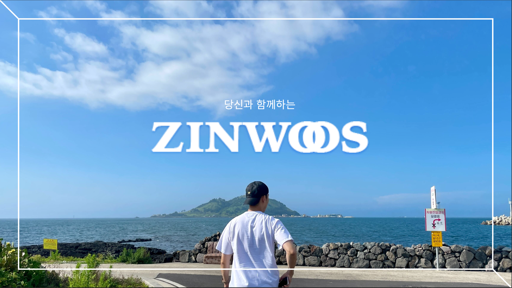
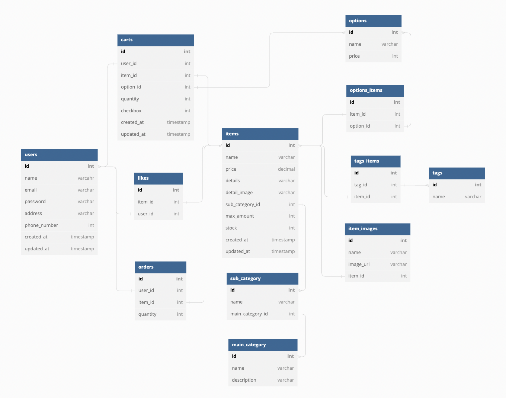

# ZINWOOS



## 📖 DESCRIPTION

- ZINWOOS는 스타의 애장품과 굿즈를 판매하는 커머스 사이트입니다.
- 매트리스 업체 'ZINUS'의 홈페이지를 모티브로 하였으며, 팀 회의를 통해 업체명이 제 이름(최진우)과 같은 점을 바탕으로 프로젝트를 기획했습니다.
- 회원가입/로그인, 상품 검색 및 조회, 위시리스트 관리, 장바구니 및 주문 기능 등을 구현했습니다.
- 첫 팀 프로젝트로서 프로젝트의 생산성 및 효율성 제고를 위해 다양한 협업 방식을 습득했습니다. (업무 분담, 일정 관리 및 팀원 간 소통 방식 등)

### BASIC INFORMATION

- 개발 기간: 2022.09.19 ~ 2022.09.30
- 개발 인원: 7명(FE 4명, BE 3명)
- ERD
  
- API Documentation: https://documenter.getpostman.com/view/23364549/2s83YSK7Rp

### FOLDER STRUCTURE

```
├── README.md
├── api
│   ├── controllers
│   │   ├── cartController.js
│   │   ├── index.js
│   │   ├── itemController.js
│   │   ├── likeController.js
│   │   ├── orderController.js
│   │   └── userController.js
│   ├── models
│   │   ├── cartDao.js
│   │   ├── data-source.js
│   │   ├── index.js
│   │   ├── itemDao.js
│   │   ├── likeDao.js
│   │   ├── orderDao.js
│   │   └── userDao.js
│   ├── routes
│   │   ├── cartRouter.js
│   │   ├── index.js
│   │   ├── itemRouter.js
│   │   ├── likeRouter.js
│   │   ├── orderRouter.js
│   │   └── userRouter.js
│   ├── services
│   │   ├── cartService.js
│   │   ├── index.js
│   │   ├── itemService.js
│   │   ├── likeService.js
│   │   ├── orderService.js
│   │   └── userService.js
│   └── utils
│       ├── auth.js
│       ├── error.js
│       └── validator.js
├── app.js
├── db
│   └── migrations
│       ├── 20220920015256_users.sql
│       ├── 20220920015303_main_categories.sql
│       ├── 20220920015304_sub_categories.sql
│       ├── 20220920015305_items.sql
│       ├── 20220920015315_options.sql
│       ├── 20220920015343_tags.sql
│       ├── 20220920015509_carts.sql
│       ├── 20220920015521_options_items.sql
│       ├── 20220920015528_tags_items.sql
│       ├── 20220920061401_item_images.sql
│       ├── 20220926073446_likes.sql
│       └── 20220928023000_orders.sql
├── node_modules
├── package-lock.json
└── package.json
```

### TECH STACK

- Server: Javascript, Node.js, Express
- Database: MySQL, TypeORM
- DevOps: AWS-RDS
- Tools: Postman, dbdiagram, Git, GitHub, Trello, Slack

## ⌨️ FUNCTIONS

### 회원가입/로그인

- 정규표현식을 통한 아이디 및 비밀번호 검증
- Bcrypt 암호화, JWT 인증을 통한 회원가입/로그인 구현

### 상품 조회

- Query Parameter를 사용하여 전체 상품과 카테고리별 상품 조회
- 상품 조회 시 가격, 인기 및 이름순 정렬
- 상품 상세 정보 조회(상품별 이미지, 옵션 및 설명 등)

### 위시리스트

- 위시리스트 추가, 조회, 삭제 API

### 장바구니, 주문

- 장바구니 CRUD 기능
- 트랜잭션 처리를 통한 주문 API

## 👥 TEAMMATES

- FrontEnd: 강진수, 안나라, 이가을, 조재현
- BackEnd: 김성식, 정인호, 최진우

## ⚠️ LICENSE

- 이 프로젝트는 'ZINUS' 홈페이지를 참고하여 학습 목적으로 제작되었기 때문에 이 코드를 활용하여 이득을 취하거나 무단 배포할 경우 법적으로 문제가 될 수 있습니다.
- 이 프로젝트에서 사용하고 있는 사진 대부분은 개인 소유/제작물이므로 무단으로 배포하거나 사용할 경우 법적으로 문제가 될 수 있습니다.

## 📱 CONTACT

최진우
choiramsey8@gmail.com / https://velog.io/@choiramsey8
